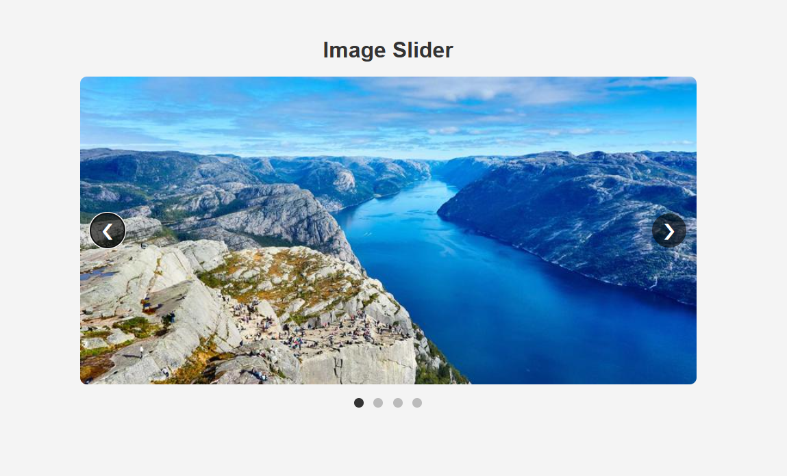

# Image Slider

A simple and responsive Image Slider application built with HTML, CSS, and Vanilla JavaScript. It allows users to navigate through images using previous/next buttons, dot indicators, and automatic slide transitions.

## Features

* Previous and Next navigation buttons
* Dot navigation indicators
* Automatic slide transitions every 3 seconds
* Infinite looping through slides
* Responsive design for desktop, tablet, and mobile devices
* Active slide and dot highlighting
* Built with pure HTML, CSS, and JavaScript

## Technologies Used

* HTML5
* CSS3
* Vanilla JavaScript

## Project Structure

```text
vanilla-js-carousel/
│
├── index.html
├── style.css
├── script.js
├── screenshot.png
└── README.md
```

## Screenshot



## How to Run

1. Clone the repository:

```bash
git clone https://github.com/Areej39/vanilla-js-carousel.git
```

2. Navigate to the project folder:

```bash
cd vanilla-js-carousel
```

3. Open `index.html` in your browser.

## Learning Outcomes

This project demonstrates:

* DOM selection and manipulation
* Event handling with JavaScript
* Using classes to manage UI state
* Working with arrays of DOM elements
* Implementing image carousel functionality
* Creating responsive layouts with CSS
* Using timers with `setInterval()`
